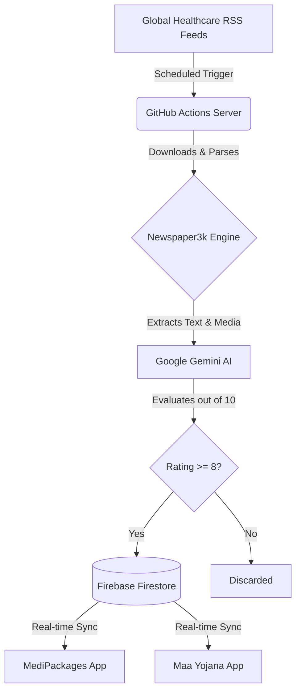

  
  
  

# ⚕️ Nexus Healthcare News Engine

An intelligent, zero-touch automation engine designed to curate, evaluate, and publish high-tier global healthcare news directly to your user-facing applications. 

Powered by **Google Gemini 3.1 Flash**, this pipeline acts as an autonomous Editor-in-Chief. It monitors top healthcare feeds daily, scores articles based on premium quality metrics, and silently synchronizes only the best content (Rating 8+) to your Firestore database.

---

## 🧠 System Architecture

## 🌟 Key Technical Achievements

- **Autonomous Curation**: Completely eliminates manual data entry by utilizing AI as an automated Editor-in-Chief.
- **Serverless Automation**: Leverages GitHub Actions cron jobs for 100% free, zero-maintenance execution.
- **Intelligent Filtering**: Employs Google Gemini 3.1 Flash to enforce a strict quality threshold (8/10 rating minimum), ensuring zero "filler" or duplicate content reaches the end user.
- **Cross-Platform Delivery**: Feeds directly into a unified Firebase Firestore NoSQL database, instantly reflecting across iOS, Android (Flutter), and Web (React) platforms in real-time.

## 🛠️ Technology Stack

- **Language**: Python 3.x
- **Data Pipeline**: `newspaper3k` (NLP article extraction), `feedparser` (RSS)
- **AI Integration**: Google Gemini 3.1 Flash (Prompt Engineering & Scoring)
- **Database**: Firebase Admin SDK (Cloud Firestore)
- **CI/CD**: GitHub Actions

